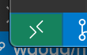
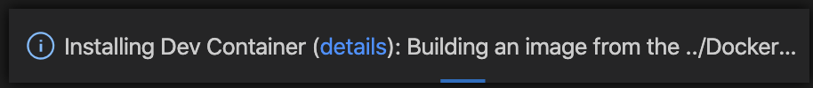

# Interview Starter Kit

Hello!

There will be a live coding section of the interview. In order to set you up for success, we highly recommend having your local machine set up to be able to write code and run it in the language of your choice.

Without this, we can still use an online REPL, but on your machine, you can use the editor you are familiar and tools you are used to using (e.g. tests and static analysis). You are welcome to set this up yourself or use this repo as a starter.

The repository has setups for different languages on different branches. To use one of them:

1. Clone this repo
2. View a list of possible branches to use with `git branch -r`
3. Run `git checkout` followed by the git branch selected from step 2

## Python 3 - Docker Environment

You are on the branch for a Dockerized Python 3 development environment configured with [pytest](https://docs.pytest.org) for testing.

Installation:

1. Make sure you have [Docker](https://www.docker.com/get-started) installed and running
2. Start the docker dev environment by choosing one of the two options below:

### Developing with VSCode on Docker (recommended)

VSCode supports [developing directly from a docker container](https://code.visualstudio.com/docs/remote/containers#_getting-started). We have already configured this repo to leverage this capability. Here are the steps to utilize it:

1. Install [Visual Studio Code](https://code.visualstudio.com/)
2. Install the [Remote Development extension pack](https://aka.ms/vscode-remote/download/extension).
3. Open this repo in VSCode and click this icon in the bottom-left of the editor: 
   - Select: `Remote-Containers: Reopen in Container` from the menu
   - This may take some time the first time as the docker image is built and started. It should provide a progress notice like this: 
4. Select the python interpreter (it should have `pipenv` in the title)

### Developing from the Docker Container Directly

Alternatively, if you would prefer not to use VSCode you can also run and connect to a docker dev environment directly using:

1. Run `docker-compose build` (to make sure your docker image is up to date)
2. Run `docker-compose run ctl-dev bash`

## Testing

This branch is configured with [pytest](https://docs.pytest.org) for automated testing. This can be run in watch mode with:

```sh
pipenv run ptw
```

Or run once with `pipenv run pytest`

## Running the Code

To run the code as a script, run:

```sh
pipenv run python main.py
```
